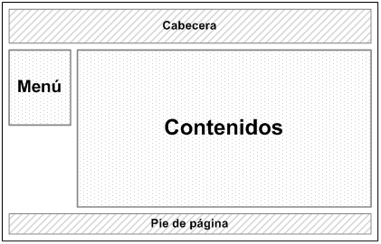

.. include:: global.rst

.. _diseno:

*****************
Proceso de Diseño
*****************

Introducción
============

En esta sección figuran las actividades y criterios que se utilizan para realizar el diseño arquitectónico del sistema tanto a nivel detallado (arquitectura de los componentes) como a nivel global (arquitectura del sistema).

Alcance
=======

El Proceso de diseño comprende una descripción de la elección e implementación de la arquitectura tanto del sistema en general como de los componentes y las interfaces. 

Objetivos
=========

El propósito de dicha sección es describir las actividades que son llevadas a cabo durante el proceso de diseño del software. Se definirán una serie de recomendaciones a tener en cuenta además de los procedimientos que deben ejecutar los integrantes del equipo.

A su vez, las tareas de SQA en el proceso de diseño deben comprender: 
 
* Verificación de que todos los elementos de diseño que no cumplieran con la calidad requerida sean procesados de acuerdo a los estándares y procedimientos establecidos. 
* Verificación de la existencia y uso de una matriz de trazabilidad para todos los requerimientos de diseño. 
* Verificación de la contemplación de todos los requerimientos especificados referidos a materia de diseño.

Especificar la Arquitectura
===========================

A fin de asegurar que la arquitectura seleccionada sea la adecuada para llevar a cabo el desarrollo, el equipo de trabajo deberá definir un proceso de evaluación iterativo para las diferentes arquitecturas pre-seleccionadas. 
Dicho proceso de evaluación deberá definir mínimamente las siguientes actividades:

* Recopilación de escenarios: desarrollar un conjunto de casos de uso (o user stories) para representar al sistema desde el punto de vista del usuario.
* Deducción de requisitos, restricciones y descripciones del entorno: asegurar que se entienden todas las preocupaciones de los participantes.
* Descripción de los estilos/patrones arquitectónicos elegidos para dirigir los escenarios y requisitos.
* Evaluación de los atributos de calidad: la evaluación de un diseño arquitectónico deberá tener en cuenta la confiabilidad, desempeño, seguridad, facilidad de mantenimiento, flexibilidad, facilidad de prueba, portabilidad, facilidad de reutilización e interoperabilidad.
* Identificación de la sensibilidad de los atributos: la realización de pequeños cambios en la arquitectura para identificar el impacto que tienen los mismos sobre un atributo de calidad específico.
* Análisis de las arquitecturas alternas (descritas en el paso 3) empleando el análisis de sensibilidad aplicado en el paso 5.

El empleo de este proceso permitirá descartar aquellas arquitecturas que no son idóneas para desarrollar el producto, o modificar aquellas que tienen potencial pero no cumplen con los requisitos necesarios. Una vez que se tiene este conjunto reducido, se aplica nuevamente el proceso hasta obtener la arquitectura óptima.

Especificar los Componentes
===========================

El equipo deberá definir lineamientos generales que le permitan avanzar en el diseño de componentes. Dichos lineamientos son:

* Definir convenciones de asignación de nombres para los componentes.
* Modelar las dependencias de izquierda a derecha y la herencia de abajo (componentes derivados) hacia arriba (componentes principales).
 
Las técnicas sugeridas para el diseño de componentes son:

* Minimizar dependencias entre componentes evitando propagar los cambios entre muchos componentes y por ende sus pruebas. 
* Diseñar componentes cohesivos que encapsulen un conjunto de responsabilidades. 
* Aislar las dependencias con tecnologías Middleware.
* Utilizar la descomposición para estructurar componentes jerárquicamente. 
* Reducir al mínimo las llamadas entre componentes, ya que pueden resultar costosas si los componentes se distribuyen. 

Especificar las Interfaces
==========================

La estructura de las páginas deberá ser fragmentada en varias secciones de manera tal de generar un flujo visual óptimo que le permita al usuario encontrar lo que desea con el menor esfuerzo posible.
El siguiente esquema ofrece una estructuración básica que deberá tener una GUI. En la misma se destacan las siguientes secciones:

* Cabecera: donde se proporciona la información básica acerca de la página. Aquí se destaca el logotipo de la organización encargada de la página y la fecha actual.
* Contenidos: donde están estructurados los diferentes contenidos que se ofrecen
* Menú: se presentan las opciones de navegación de la página
* Pie de Página: se muestra información respecto al creador de la página y derechos de copyright.

Aspectos de Usabilidad
======================

* No deberá tener funciones ambiguas u engorrosas de utilizar. 
* No deben haber 2 caminos diferentes para completar la misma función, es decir, cada función debe usarse siempre de la misma manera.
* La interfaz debe (de ser posible) anticiparse a las necesidades del usuario.
* Cada cambio u error en el sistema debe ser comunicado al usuario.
* Se deberá destacar aquellas funcionalidades que son relevantes
* Los iconos gráficos deberán representar las mismas funciones en distintas interfaces.(Ejemplo: Un icono de tilde verde no puede representar un operación bien realizada en una GUI, y en otra GUI representar la operación de añadir algun dato)
* Se deberán usar frases cortas y concisas al comunicarse con el usuario.

Métricas Sugeridas
==================

A continuación se sugieren una serie de métricas que el equipo deberá tener en cuenta a lo largo del proceso de diseño.

* Métricas de Diseño Arquitectónico: en este punto se sugiere el uso de las métricas de Fenton para comparar diferentes arquitecturas de un programa mediante un conjunto de dimensiones directas (por ejemplo: tamaño, profundidad, anchura, relacion arco-nodo).

* Métricas de Diseño de Componentes: estas métricas están centradas en la cohesión, acoplamiento y complejidad del módulo. Para las métricas de cohesión se sugiere utilizar las métricas establecidas por Bieman y Ott.

    Para las métricas de acoplamiento se sugiere utilizar el enfoque de Dhama que establece la siguiente métrica para el acoplamiento de un módulo:
	 
    mc = k/M
  
    Donde k=1 es una constante de proporcionalidad y M queda definido de la siguiente manera:
		
    M = di + a\* ci + do + b\*co + gd + c\*gc + w + r 
	
    donde
	
 	    a=b=c=2 
		di = número de parámetros de datos de entrada
		ci = número de parámetros de control de entrada
		do = número de parámetros de datos de salida
		co = número de parámetros de control de salida
		gd = número de variables globales usadas como datos
		gc = número de variables globales usadas como control
		w = número de módulos llamados (expansión)
		r = número de módulos que llaman al módulo en cuestión (concentración)

    Cuanto mayor es el valor de mc, menor es el acoplamiento de módulo.

    Para las métricas de complejidad, se recomienda el uso de la métrica de Complejidad Ciclomática.	
	
* Métricas de Diseño de Interfaces: se sugiere la conveniencia de la representación (CR) como métrica de diseño para interfaces hombre-máquina. Una GUI típica usa entidades de representación, iconos gráficos, texto, menús, ventanas y otras para ayudar al usuario a completar tareas. Para realizar una tarea dada usando una GUI, el usuario debe moverse de una entidad de representación a otra. Las posiciones absolutas y relativas de cada entidad de representación, la frecuencia con que se utilizan y el “costo” de la transición de una entidad de representación a la siguiente contribuirá a la conveniencia de la interfaz. Para una representación específica se pueden asignar costos a cada secuencia de acciones de acuerdo con la siguiente relación: 
 
    Costos = Ó[frecuencia de transición (ki) x costos de transición (ki)] 

    donde k es la transición i específica de una entidad de representación a la siguiente cuando se realiza una tarea específica. Esta suma se da con todas las transiciones de una tarea en particular o conjunto de tareas requeridas para conseguir alguna función de la aplicación. El costo puede estar caracterizado en términos de tiempo, retraso del proceso o cualquier otro valor razonable, tal como la distancia que debe moverse el ratón entre entidades de la representación.
    Para calcular la representación óptima de una GUI, la superficie de la interfaz (el área de la pantalla) se divide en una cuadrícula. Cada cuadro de la cuadrícula representa una posible posición de una entidad de la representación. Para una cuadrícula con N posibles posiciones y K diferentes entidades de representación para colocar, el número posible de distribuciones se representa de la siguiente manera:
 
    Número posible de distribuciones = [N !/ (K! * (N - K)!] * K! Es importante 

    Hay que destacar que la selección de un diseño de GUI puede guiarse con métricas tales como CR, pero el árbitro final debería ser la respuesta del usuario basada en prototipos de GUI.

Herramientas
============

A fin de automatizar y reducir la carga de trabajo sobre el equipo, se sugiere el uso de las siguientes herramientas:

* Django: el desarrollo de aplicaciones sobre esta herramienta ofrece una arquitectura MVC compuesta por Models y Views, en donde el programador define la lógica de su aplicación en los Models y la forma de presentar los datos en los Views. A su vez, ofrece un nivel de definición de los componentes mediante los egg packages, que permite hacer utilización de un componente específico en varios fuentes.
    A nivel de desarrollo visual de las páginas web, Django permite hacer uso de los llamados template tags, que posibilitan el reuso de componentes HTML a lo largo de varios archivos HTML.
* Dreamviewer: esta herramienta posibilita la creación de páginas web utilizando un esquema de drag&drop, que facilita el trabajo de los diseñadores. Proporciona un conjunto de plugins que pueden ser añadidos para mejorar la presentación.
